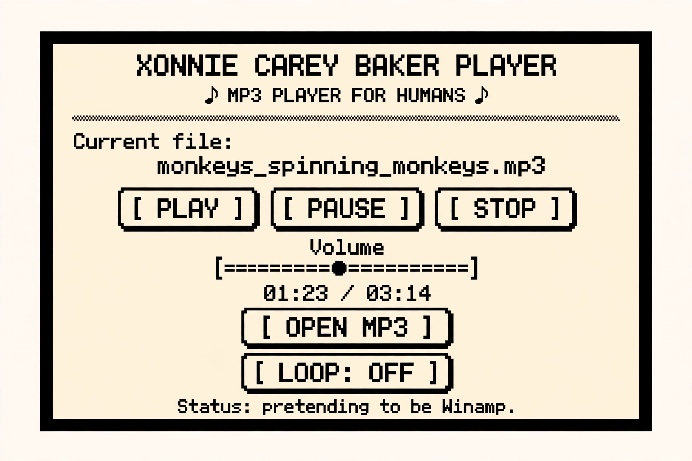

# XONNIE CAREY BAKER — v0.1.3

*«A tiny MP3 player that takes itself way too seriously.»*

Small code. Real audio. Zero bullshit.

## 1. What is this?

Demo MP3 player kecil dalam Python (~350 baris total, dua file).
Bukan produk, bukan framework. Hanya bukti bahwa player sederhana
bisa dibuat dalam kode yang bisa dibaca manusia — dan sedikit lucu.

## 2. Mockup

    +--------------------------------------+
    |        XONNIE CAREY BAKER            |
    |      ♪ MP3 PLAYER FOR HUMANS ♪       |
    |                                      |
    |  Current file:                       |
    |  monkeys_spinning_monkeys.mp3        |
    |                                      |
    |     [ PLAY ] [ PAUSE ] [ STOP ]      |
    |                                      |
    |              Volume                  |
    |     [========●=========]             |
    |                                      |
    |          01:23 / 03:14               |
    |                                      |
    |          [ OPEN MP3 ]                |
    |          [ LOOP: OFF ]               |
    |                                      |
    | Status: pretending to be Winamp.     |
    +--------------------------------------+

## 3. Installation

Butuh Python 3.8+ dengan Tkinter (sudah termasuk di installer
python.org untuk Windows/macOS; di Debian/Ubuntu mungkin perlu
`sudo apt install python3-tk`).

    python -m venv .venv

Windows:

    .venv\Scripts\activate

Linux/macOS:

    source .venv/bin/activate

Lalu:

    pip install -r requirements.txt

## 4. Running

    python main.py

Cek cepat sebelum menjalankan (opsional tapi disarankan):

    python -m py_compile main.py player.py

Pastikan juga constructor dan entry point utuh di file-mu
(karena beberapa editor/tool bisa merusak underscore ganda):

    grep -n "__init__" main.py player.py
    grep -n "__name__" main.py

Yang benar: `def __init__(self, root):`, `def __init__(self):`,
dan `if __name__ == "__main__":` — masing-masing dengan DUA
underscore di setiap sisi.

## 5. Controls

| Aksi         | Efek                                              |
|--------------|---------------------------------------------------|
| OPEN MP3     | Pilih satu file .mp3 dari komputermu              |
| PLAY         | Putar (atau lanjutkan jika sedang pause)          |
| PAUSE        | Bekukan musik di tengah emosi                     |
| STOP         | Hentikan, reset ke 00:00                          |
| Volume       | Slider 0–100% (bertahan meski ganti lagu)         |
| LOOP: ON     | Lagu diulang otomatis setelah selesai             |
| tutup window | Audio dihentikan & resource dibebaskan dengan rapi |

**Audio:** repo ini TIDAK menyertakan lagu apa pun (apalagi yang
ber-copyright). Gunakan MP3 milikmu sendiri, atau musik
royalty-free / public domain, misalnya:

- Kevin MacLeod (incompetech.com) — misalnya *Monkeys Spinning Monkeys*
- Free Music Archive (freemusicarchive.org)
- Atau rekam suaramu sendiri bernyanyi. Itu juga valid.

## 6. Architecture

    main.py    -> Tkinter GUI, polling tiap 200 ms, cleanup saat close,
                  semua status humor
    player.py  -> state machine stopped/playing/paused,
                  load/play/pause/stop/volume/loop/close

Dua file Python. Sengaja. GUI hanya menyentuh audio lewat player.

## 7. Audio playback model (versi sederhana + jujur)

1. `pygame.mixer.init()` menyiapkan output audio.
2. `pygame.mixer.music.load(path)` memberi pygame file MP3;
   decoding ditangani SDL_mixer di thread audio — GUI tidak
   pernah terblokir.
3. `pygame.mixer.music.play()` mulai memutar. Loop TIDAK memakai
   `loops=-1`, melainkan ditangani manual di `tick()`, supaya
   toggle LOOP di tengah lagu langsung efektif.
4. `mutagen` dipakai sekali saat load untuk membaca durasi
   (pygame tidak menyediakannya). Jika metadata rusak, durasi
   jadi 0.0 dan file tetap dicoba dimainkan.
5. GUI memanggil `tick()` tiap 200 ms: mendeteksi lagu selesai
   (`get_busy()` False saat state playing) untuk LOOP dan status
   "music has escaped.".

Quirk pygame yang ditangani di `player.py` (verifikasi terhadap
dokumentasi resmi pygame):

- **load() me-reset volume ke penuh** (terdokumentasi) → volume
  user disimpan di `_volume` dan di-reapply setelah load.
- **get_busy() == False saat paused** (terdokumentasi sejak
  2.0.1) → `tick()` memeriksa state internal dulu; pause tidak
  pernah dianggap lagu selesai.
- **get_pos() tidak dispesifikasi perilakunya saat pause**;
  implementasi pygame terus menghitung wall-clock. Koreksi
  `_pause_offset` memakai rumus yang benar untuk kedua
  kemungkinan perilaku (maju atau beku saat pause), sehingga
  resume selalu lanjut persis dari titik pause:
  00:17 → PAUSE → tunggu 5 detik → 00:17, 00:18, 00:19...

Saat window ditutup: polling `after()` di-cancel → audio
dihentikan & mixer di-quit → window di-destroy. Tidak ada
callback yang menyentuh root mati atau audio yang sudah
dibersihkan.

## 8. Limitations

- Satu file saja. Tidak ada playlist. Tidak ada drag & drop.
- Tidak ada seek bar (sengaja — lihat prinsip proyek).
- Progress bisa meleset hingga ~200 ms karena interval polling.
- UI hanya menerima `.mp3` (pygame mungkin bisa memutar OGG/WAV).
- Jika durasi tidak terbaca mutagen, total waktu tampil 00:00.

## 9. Changelog

- **v0.1.3** — final correction: constructor `__init__` dan entry
  point `__name__` dipastikan benar di artifact final; seluruh
  pola literal diaudit ulang (tidak ada `def init(`, tidak ada
  `if name ==`, tidak ada prose telanjang); urutan init `App`
  dan urutan cleanup `on_close` disesuaikan spec.
- **v0.1.2** — full audit & repair: cleanup saat close, reset
  state saat play() gagal, exception mutagen dipersempit, clamp
  posisi terhadap durasi, volume awal eksplisit.
- **v0.1.1** — fix mainloop-setelah-destroy, fix volume reset
  saat load.
- **v0.1** — konsep awal.

## 10. Future versions (mungkin, kalau mood)

- v0.2: seek bar sederhana
- v0.3: playlist (folder penuh MP3)
- v1.0: tidak akan pernah ada. itu poinnya.